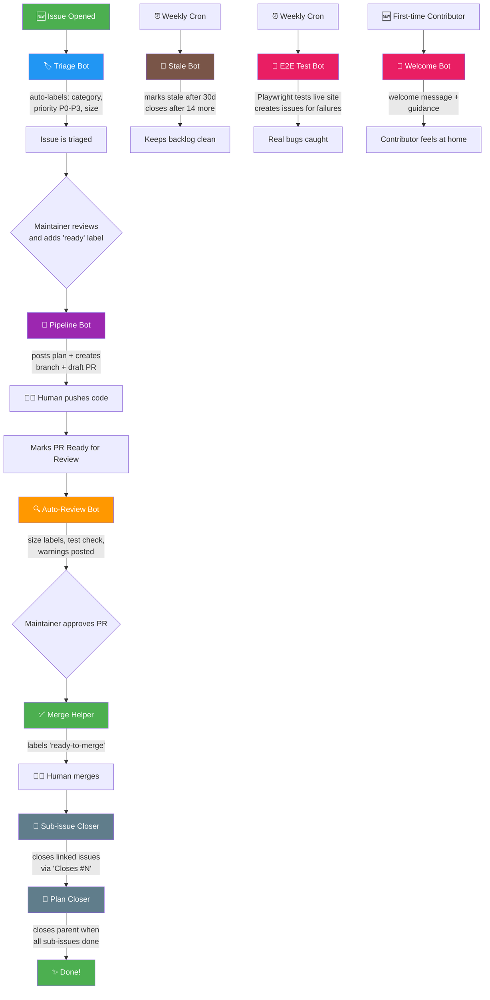

# Contributing to Open AI School

Thanks for your interest in contributing! This guide covers how our automated workflow pipeline works across all repos in this org.

## 🤖 Automated Workflow Pipeline

All repos use a fully automated GitHub Actions pipeline. As a maintainer, you add a single `ready` label — bots handle the rest.

### Bot Reference

| Bot | Trigger | What it does |
|-----|---------|-------------|
| 🏷️ **Triage** | Issue opened | Auto-labels (`bug`, `feature`, `docs`), sets priority (`P0`–`P3`), adds size label |
| �� **Pipeline** | `ready` label | Posts implementation plan, creates feature branch + draft PR |
| 🔍 **Auto-Review** | PR ready for review | Posts size stats, checks for tests/docs, adds warnings |
| ✅ **Merge Helper** | PR approved + checks pass | Labels `ready-to-merge` for human to merge |
| 🔗 **Sub-issue Closer** | PR merged | Closes issues referenced with `Closes #N` |
| 🎯 **Plan Closer** | Sub-issue closed | Closes parent when all sub-issues are done |
| 🧪 **E2E Test** | Weekly (Sundays) | Playwright tests every page of the live site, creates issues for failures |
| 🧹 **Stale Bot** | Weekly cron | Marks inactive issues/PRs stale, closes after 14 days |
| 👋 **Welcome Bot** | First issue/PR | Welcomes new contributors with guidance |

> 💡 All workflows use **per-issue/per-PR concurrency groups** — no race conditions, no cancelled builds.

## How to Contribute

1. Find an issue labelled [`good first issue`](https://github.com/open-ai-school/ai-seeds/labels/good%20first%20issue) or [`help wanted`](https://github.com/open-ai-school/ai-seeds/labels/help%20wanted)
2. Comment that you'd like to work on it
3. A maintainer will add the `ready` label — the pipeline creates a draft PR for you
4. Push your changes to the PR branch
5. Mark the PR as ready for review — bots will review automatically
6. A maintainer reviews and merges

## Questions?

Join our [Discussions](https://github.com/open-ai-school/ai-seeds/discussions) — we're happy to help!
