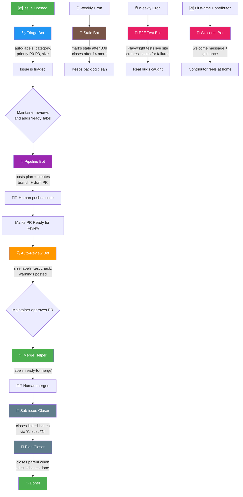

# 🎓 Open AI School

### Free, open-source, multilingual AI education for everyone

---

**Learn AI from zero — no coding experience, no math degree, no jargon.**

🌍 Available in **English** · **Français** · **Nederlands** · **हिन्दी** · **తెలుగు** · *more coming soon!*

## 🌱 Our Mission

We believe AI education should be **free**, **accessible**, and **available in your language**. Too many learners — especially in India and the Global South — are left behind because quality AI resources are in English, behind paywalls, or assume prior technical knowledge.

Open AI School changes that. We start from the very basics and build understanding step by step, using everyday language and real-world analogies.

## 📚 What We Offer

| | Feature | Description |
|---|---|---|
| 🌱 | **Beginner-First** | No prerequisites — we start from "What is AI?" |
| 🌍 | **Multilingual** | Content in 5+ languages and growing |
| 🧪 | **Interactive** | Hands-on AI Playground with TensorFlow.js |
| 💝 | **100% Free** | No paywalls, no subscriptions, ever |
| 🔓 | **Open Source** | All code and content on GitHub |
| 📱 | **Mobile Friendly** | Learn on any device |

## 🤖 Automated Workflow Pipeline

All repos in this org use a fully automated GitHub Actions pipeline. Maintainer adds a single `ready` label — bots handle the rest.

### Workflow Details

| Bot | Trigger | What it does |
|-----|---------|-------------|
| 🏷️ **Triage** | Issue opened | Auto-labels (`bug`, `feature`, `docs`), sets priority (`P0`–`P3`), adds size label |
| 🚀 **Pipeline** | `ready` label | Posts implementation plan, creates feature branch + draft PR |
| 🔍 **Auto-Review** | PR ready for review | Posts size stats, checks for tests/docs, adds warnings |
| ✅ **Merge Helper** | PR approved + checks pass | Labels `ready-to-merge` for human to merge |
| 🔗 **Sub-issue Closer** | PR merged | Closes issues referenced with `Closes #N` |
| 🎯 **Plan Closer** | Sub-issue closed | Closes parent when all sub-issues are done |
| 🧪 **E2E Test** | Weekly (Sundays) | Playwright tests every page of the live site, creates issues for failures |
| 🧹 **Stale Bot** | Weekly cron | Marks inactive issues/PRs stale, closes after 14 days |
| 👋 **Welcome Bot** | First issue/PR | Welcomes new contributors with guidance |

> 💡 All workflows use **per-issue/per-PR concurrency groups** — no race conditions, no cancelled builds.

## 🚀 Get Started

Visit **[open-ai-school.vercel.app](https://open-ai-school.vercel.app)** and start your first lesson — it takes 10 minutes!

## 🤝 Contributing

We welcome contributions from everyone! Here's how you can help:

- 🌍 **Translate** — Add your language ([see open issues](https://github.com/open-ai-school/ai-seeds/labels/good%20first%20issue))
- ✍️ **Write lessons** — Share your AI knowledge
- 💻 **Code** — Dark mode, new features, AI demos
- 📣 **Share** — Tell your friends, classmates, communities
- 💬 **Discuss** — Join our [Discussions](https://github.com/open-ai-school/ai-seeds/discussions)

Check out our [contribution guide](https://github.com/open-ai-school/ai-seeds/blob/main/CONTRIBUTING.md) to get started.

## 👨‍💻 Built By

[**@rameshreddy-adutla**](https://github.com/rameshreddy-adutla) · [LinkedIn](https://linkedin.com/in/rameshreddy-adutla) · [☕ Buy Me a Coffee](https://buymeacoffee.com/rameshreddyadutla)

---

**⭐ Star our repos if you believe in free AI education for all**

